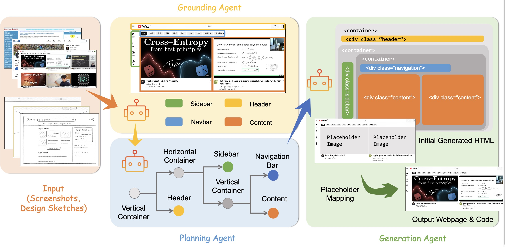

# ScreenCoder: Advancing Visual-to-Code Generation for Front-End Automation via Modular Multimodal Agents

<div align="center">

Yilei Jiang<sup>1*</sup>, Yaozhi Zheng<sup>1*</sup>, Yuxuan Wan<sup>2*</sup>, Jiaming Han<sup>1</sup>, Qunzhong Wang<sup>1</sup>,  
Michael R. Lyu<sup>2</sup>, Xiangyu Yue<sup>1✉</sup>  
<br>
<sup>1</sup>CUHK MMLab, <sup>2</sup>CUHK ARISE Lab  
<br>
<sup>*</sup>Equal contribution  <sup>✉</sup>Corresponding author

<a href="https://arxiv.org/abs/2507.22827">
    
  </a>
  <a href="https://huggingface.co/spaces/Jimmyzheng-10/ScreenCoder">
    
  </a>
</div>
<div align="center">
  
  
</div>

## Introduction

**ScreenCoder** is an intelligent UI-to-code generation system that transforms any screenshot or design mockup into clean, production-ready HTML/CSS code. Built with a modular multi-agent architecture, it combines visual understanding, layout planning, and adaptive code synthesis to produce accurate and editable front-end code.

It also supports customized modifications, allowing developers and designers to tweak layout and styling with ease. Whether you're prototyping quickly or building pixel-perfect interfaces, ScreenCoder bridges the gap between design and development — just copy, customize, and deploy.

## Huggingface Demo
- Try our huggingface demo at [Demo](https://huggingface.co/spaces/Jimmyzheng-10/ScreenCoder)

- Run the demo locally (download from huggingface space):

  ```bash
  python app.py
  ```
  
## Demo Videos

A showcase of how **ScreenCoder** transforms UI screenshots into structured, editable HTML/CSS code using a modular multi-agent framework.

### Youtube Page

https://github.com/user-attachments/assets/5d4c0808-76b8-4eb3-b333-79d0ac690189

### Instagram Page

https://github.com/user-attachments/assets/9819d559-863e-4126-8506-1eccaa806df0

### Design Draft（allow customized modifications!）

https://github.com/user-attachments/assets/d2f26583-4649-4b6d-8072-b11cd1025f4b

## Qualitative Comparisons

We present qualitative examples to illustrate the improvements achieved by our method over existing approaches. The examples below compare the output of a baseline method with ours on the same input.

### Baseline or Other Method


### Our Method


As shown above, our method produces results that are more accurate, visually aligned, and semantically faithful to the original design.

## Project Structure
- `main.py`: The main script to generate final HTML code for a single screenshot.
- `UIED/`: Contains the UIED (UI Element Detection) engine for analyzing screenshots and detecting components.
  - `run_single.py`: Python script to run UI component detection on a single image.
- `html_generator.py`: Takes the detected component data and generates a complete HTML layout with generated code for each module.
- `image_replacer.py`: A script to replace placeholder divs in the final HTML with actual cropped images.
- `mapping.py`: Maps the detected UIED components to logical page regions.
- `requirements.txt`: Lists all the necessary Python dependencies for the project.
- `doubao_api.txt`: API key file for the Doubao model (should be kept private and is included in `.gitignore`).

## Setup and Installation

1.  **Clone the repository:**
    ```bash
    git clone https://github.com/leigest519/ScreenCoder.git
    cd screencoder
    ```

2.  **Create a virtual environment:**
    ```bash
    python3 -m venv .venv
    source .venv/bin/activate
    ```

3.  **Install dependencies:**
    ```bash
    pip install -r requirements.txt
    ```
4. **Configure the model and API key**
    - ***Choose a generation model***: Set the desired model in `block_parsor.py` and `html_generator.py`. Supported options: Doubao(default), Qwen, GPT, Gemini.
    - ***Add the API key***: Create a plain-text file (`doubao_api.txt`, `qwen_api.txt`, `gpt_api.txt`, `gemini_api.txt`) in the project root directory that corresponds to your selected model, and paste your API key inside.

## Usage

The typical workflow is a multi-step process as follows:

1.  **Initial Generation with Placeholders:**
    Run the Python script to generate the initial HTML code for a given screenshot.
    - Block Detection:
      ```bash
      python block_parsor.py
      ```
    - Generation with Placeholders (Gray Images Blocks):
      ```bash
      python html_generator.py
      ```

2.  **Final HTML Code:**
    Run the python script to generate final HTML code with copped images from the original screenshot.
    - Placeholder Detection:
      ```bash
      python image_box_detection.py
      ```
    - UI Element Detection:
      ```bash
      python UIED/run_single.py
      ```
    - Mapping Alignment Between Placeholders and UI Elements:
      ```bash
      python mapping.py
      ```
    - Placeholder Replacement:
      ```bash
      python image_replacer.py
      ```

3.  **Simple Run:**
    Run the python script to generate the final HTML code:
    ```bash
    python main.py
    ```

## More Projects on MLLM for Web/Code Generation
- [WebPAI (Web Development Powered by AI)](https://github.com/WebPAI) released a set of research resources and datasets for webpage generation studies, aiming to build an AI platform for more reliable and practical automated webpage generation.

- [Awesome-Multimodal-LLM-for-Code](https://github.com/xjywhu/Awesome-Multimodal-LLM-for-Code) maintains a comprehensive list of papers on methods, benchmarks, and evaluation for code generation under multimodal scenarios.


## Acknowledgements

This project builds upon several outstanding open-source efforts. We would like to thank the authors and contributors of the following projects: [UIED](https://github.com/MulongXie/UIED), [DCGen](https://github.com/WebPAI/DCGen), [Design2Code](https://github.com/NoviScl/Design2Code)


